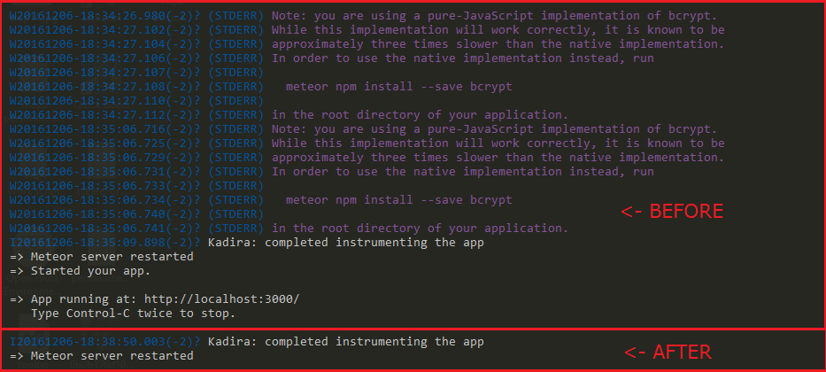
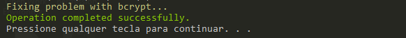

# fix-meteor-bcrypt

###### When you turn on the meteor do you get this message?

----

> (STDERR) Note: you are using a pure-JavaScript implementation of bcrypt.

> (STDERR) While this implementation will work correctly, it is known to be

> (STDERR) approximately three times slower than the native implementation.

> (STDERR) In order to use the native implementation instead, run

> (STDERR)

> (STDERR)   meteor npm install --save bcrypt

> (STDERR)

> (STDERR) in the root directory of your application.

---
So this is the solution to your problem!

Tutorial

1. Make a git clone of this repository.

2. Open the command prompt as Administrator in the folder fix-meteor-bcrypt

3. Just run the command below:

> fix-meteor-bcrypt C:\Root\Path\Absolute\To\Your\Project
> 
> **Notice:** It is very important that the command prompt be as administrator.

Now just wait for the command to be completed, and after it is finished, everything will be fixed!

Good luck! If this was useful to you for feedback so that other people will find this tutorial. ;D

[Clique aqui e leia em português](README-pt_BR.md)

## Licence
MIT